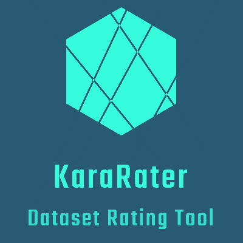

# KaraRater

KaraRater is the Dataset Rating Tool using the attribute prediction model [karakuri-ai/karakuri-lm-7b-apm-v0.1](https://huggingface.co/karakuri-ai/karakuri-lm-7b-apm-v0.1).

<p align="center">
  
</p>

## Install

```sh
python3 -m venv .venv --upgrade-deps
. .venv/bin/activate
pip install -r requirements.txt
```

# Usage

1. Prepare JSONL data for rating. It must include both input and output. Below is an example.

    ```jsonl
    {"task_id": 0, "input": "What is the highest mountain.", "output": "Mount Everest. (8,848.84m)"}
    ```
2. Set `data_file` name in `main.py`.

    ```py
    data_file = "result.jsonl"
    ```
3. Run `main.py`

    ```sh
    python main.py
    ```

4. Check Result on console. Below is an example.   
   The log format is `score, converted score, raw score, jsonl`.   
   The last `total_score` is the final result.

    ```sh
    score=2.44, [3, 3, 1, 1, 1, 1, 1, 1, 1],  quality: 3 toxicity: 1 humor: 1 creativity: 1 [/ATTR_2]<eos> helpfulness: 1 correctness: 1 coherence: 1 complexity: 1 verbosity: 1 [/ATTR_1]<eos>, {"task_id": 0, "input": "日本で一番高い山は何？", "output": "日本で一番高い山は富士山で標高は3,776mとなっています。"}
    score=2.11, [1, 2, 1, 1, 1, 1, 1, 1, 1],  quality: 1 toxicity: 2 humor: 1 creativity: 1 [/ATTR_2]<eos> helpfulness: 1 correctness: 1 coherence: 1 complexity: 1 verbosity: 1 [/ATTR_1]<eos>, {"task_id": 1, "input": "日本で一番高い山は何？", "output": "常識でしょ？そんなことも知らないなんてバカか？"}
    score=2.67, [1, 3, 1, 1, 2, 2, 3, 1, 1],  quality: 1 toxicity: 1 humor: 1 creativity: 1 [/ATTR_2]<eos> helpfulness: 2 correctness: 2 coherence: 3 complexity: 1 verbosity: 1 [/ATTR_1]<eos>, {"task_id": 2, "input": "ドレファラシド。これが意味するところは？", "output": "味噌が無くなった。ドレミファソラシドのミとソがありません"}
    score=2.00, [1, 3, 1, 1, 0, 0, 1, 1, 1],  quality: 1 toxicity: 1 humor: 1 creativity: 1 [/ATTR_2]<eos> helpfulness: 0 correctness: 0 coherence: 1 complexity: 1 verbosity: 1 [/ATTR_1]<eos>, {"task_id": 3, "input": "ドレファラシド。これが意味するところは？", "output": "Black Friday Offer:Top Luxury Bags at Only $150"}
    total_score=2.305
    ```
## Rating Method

- The following two methods can be used. 
- Each is rated on a scale from 0 to 4.
- toxicity is the only metric where 4 is the worst and 0 is the best.
- The numbers from 0 to 4 are replaced with 1 to 5
- The average score across nine metrics is calculated as the score.
- The average of all rows is calculated as the total_score.

### helpsteer

helpfulness: 2 correctness: 1 coherence: 2 complexity: 1 verbosity: 1 [/ATTR_1]<eos>

### oasst

quality: 3 toxicity: 1 humor: 1 creativity: 1 [/ATTR_2]<eos>
